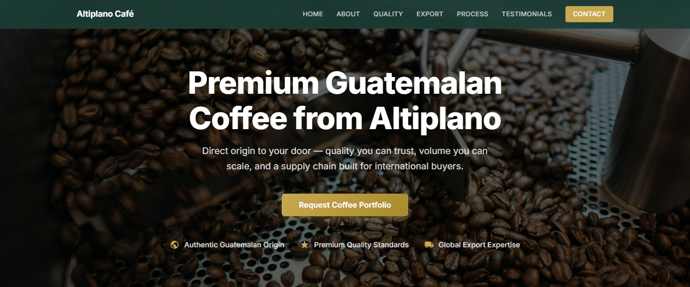

# Altiplano Café — Landing Page

<p align="center">
  
</p>

B2B landing page for **Altiplano Café**, a Guatemalan coffee exporter.

🔗 **Live:** [dalex188.github.io/altiplano-cafe-landing](https://dalex188.github.io/altiplano-cafe-landing/)

## Quick start

```bash
npm install
npx vite --host        # dev server
npx vite build         # production build
```

No backend required — lead capture goes through Formspree.

---

## Tech Stack

| Layer          | Choice                          |
|----------------|---------------------------------|
| Framework      | React 18 + TypeScript           |
| Build tool     | Vite 5                          |
| Styling        | Plain CSS (custom properties)   |
| Form handling  | Formspree (serverless)          |
| Fonts          | Inter via Google Fonts          |
| Icons          | Inline SVGs in TSX              |
| Images         | Unsplash (local in `public/images/`) |

---

## Project Structure

```
Landing page/
├── public/images/             # Static images (served at /images/)
├── src/
│   ├── AltiplanoCafeLanding.tsx   # Main React component
│   ├── AltiplanoCafeLanding.css   # All styles (~1250 lines)
│   ├── main.tsx                   # React mount point
│   └── vite-env.d.ts              # Vite type shims
├── index.html                 # Entry HTML (OG tags, fonts)
├── package.json
├── vite.config.ts
├── tsconfig.json
├── tsconfig.node.json
└── .gitignore
```

---

## Page Sections

| Section        | Behaviour / Notes                                              |
|----------------|---------------------------------------------------------------|
| **Hero**       | Full-viewport with dark overlay, CTA button, value props       |
| **About**      | Company history grid: text + image + stats cards               |
| **Quality**    | Dark background (light text), 4 quality features + image       |
| **Export**     | 4-card grid: distribution, blending, pricing, visibility       |
| **Certifications** | Light overlay on background image, 4 certification cards    |
| **Process**    | Dark background, vertical timeline with numbered steps + images|
| **Testimonials** | Dark green background, 3 review cards with 5-star ratings   |
| **Contact**    | Form with validation, consent checkbox, Formspree submission   |
| **Footer**     | 4-column grid with links and copyright                         |

---

## Navigation & UX

- **Sticky header** with brand text, desktop nav links, and hamburger menu on mobile.
- **Mobile nav overlay** — solid dark green full-screen menu when hamburger is tapped.
- **URL hash updates** automatically via Intersection Observer as you scroll through sections.
- **Smooth scrolling** across all anchor links.
- **Back to top** floating button (bottom-right corner).
- **Loading states** on the contact form (submitting/success/error).
- **`:focus-visible`** outlines for keyboard accessibility.

---

## Colour Palette

| Token                   | Hex       | Usage                        |
|-------------------------|-----------|------------------------------|
| `--primary-dark-green`  | `#1A3C34` | Headers, dark sections       |
| `--accent-gold`         | `#C8A951` | CTAs, accents, icons         |
| `--text-dark`           | `#2D2D2D` | Body text                    |
| `--text-light`          | `#FFFFFF` | Text on dark backgrounds     |
| `--bg-light`            | `#F9F7F4` | Light section backgrounds    |
| `--bg-dark`             | `#1A1A1A` | Process timeline section     |

---

## Verification

- [ ] `npm install` completes without errors
- [ ] Dev server starts with `npx vite --host`
- [ ] All sections render and scroll correctly on desktop (min 1024px)
- [ ] All sections render and scroll correctly on mobile (< 768px)
- [ ] Hamburger menu opens and navigates to each section
- [ ] URL hash updates while scrolling
- [ ] Contact form submits to Formspree with validation
- [ ] Consent checkbox is required before submission
- [ ] Images load with lazy loading
- [ ] Production build completes (`npx vite build`)
- [ ] `dist/` contains `images/` with all assets
